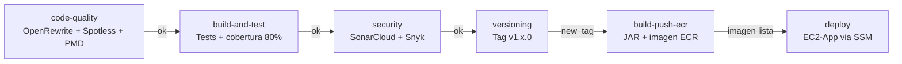

# ep03-backend

Backend REST de la aplicacion **Alumnos**, construido con **Spring Boot 3.5** y **Java 21**. Expone una API para gestion de ep03 con soporte para CRUD, exportacion/importacion CSV y documentacion OpenAPI integrada.


---

## Tecnologias

| Tecnologia          | Version   | Uso                              |
| ------------------- | --------- | -------------------------------- |
| Java                | 21 (LTS)  | Lenguaje principal               |
| Spring Boot         | 3.5.3     | Framework de aplicacion          |
| Spring Data JPA     | 3.5.x     | Persistencia ORM                 |
| Spring Security     | 6.x       | Seguridad y CORS                 |
| PostgreSQL          | 16        | Base de datos (dev y prod)       |
| H2                  | -         | Base de datos en memoria (tests) |
| Gradle              | 8.13      | Build tool                       |
| Springdoc OpenAPI   | 2.8.17    | Documentacion Swagger/ReDoc      |
| Lombok              | -         | Reduccion de boilerplate         |
| Cucumber            | 7.20      | Tests de aceptacion (BDD)        |
| Spring Cloud Contract | 4.2.3   | Tests de contrato                |
| JaCoCo              | 0.8.13    | Cobertura de codigo              |
| SonarCloud          | -         | Analisis de calidad continuo     |
| PIT Mutation Testing | 1.19     | Pruebas de mutacion              |

---

## Estructura del proyecto

```
ep03-backend/
├── src/
│   ├── main/
│   │   ├── java/cl/duocuc/ep03/
│   │   │   ├── application/          # Capa de servicio (casos de uso)
│   │   │   │   └── AlumnoService.java
│   │   │   ├── config/               # Seguridad y manejo de excepciones
│   │   │   │   ├── SecurityConfig.java
│   │   │   │   └── GlobalExceptionHandler.java
│   │   │   ├── domain/               # Modelo de dominio
│   │   │   │   └── Alumno.java
│   │   │   └── infrastructure/
│   │   │       ├── config/           # OpenAPI y CORS
│   │   │       ├── controller/       # AlumnoController (REST)
│   │   │       ├── entity/           # AlumnoEntity (JPA)
│   │   │       ├── mapper/           # AlumnoMapper (domain <-> entity)
│   │   │       └── repository/       # AlumnoRepository (JPA)
│   │   └── resources/
│   │       ├── application.yml       # Config base (H2 para tests)
│   │       ├── application-dev.yml   # Config desarrollo (PostgreSQL local)
│   │       └── application-prod.yml  # Config produccion (variables de entorno)
│   └── test/
│       ├── java/                     # Tests unitarios, contrato y BDD
│       └── resources/
│           ├── contracts/ep03/    # Contratos Spring Cloud Contract
│           ├── features/             # Escenarios Cucumber
│           └── application-test.yml
├── config/pmd/                       # Reglas PMD personalizadas
├── Dockerfile                        # Build multi-etapa (Gradle + JRE 21)
├── docker-compose.yml                # Stack local: app + base de datos
├── build.gradle                      # Dependencias y plugins
├── pgdata/                           # Datos persistentes PostgreSQL (bind mount)
│   └── data/                         # Datos reales (en .gitignore)
└── README.md
```

---

## Requisitos

| Herramienta    | Version minima |
| -------------- | -------------- |
| Docker         | 20.10+         |
| Docker Compose | 2.0+           |
| Java           | 21+ (solo para desarrollo local sin Docker) |
| Gradle         | 8.13+ (o usar `./gradlew`) |

---

## Inicio rapido con Docker

### 1. Asegurarse que ep03-db esta corriendo

Este compose asume que `ep03-db` ya esta levantado. Si no lo esta:

```bash
cd ../ep03-db
docker compose up -d
```

Verificar que esta healthy:

```bash
docker ps --filter "name=ep03-db"
```

### 2. Construir y levantar la app

```bash
docker compose up -d --build
```

### 3. Verificar que la app esta corriendo

```bash
docker compose ps
```

Resultado esperado:

```
NAME          STATUS       PORTS
ep03-backend   Up X seconds 0.0.0.0:8080->8080/tcp
```

### 4. Verificar que la app responde

```bash
curl http://localhost:8080/ep03
```

### 5. Detener la app

```bash
docker compose down
```

---

## Desarrollo local sin Docker

### 1. Compilar

```bash
./gradlew clean build -x test
```

### 2. Ejecutar con perfil dev (requiere PostgreSQL corriendo en localhost:5432)

```bash
./gradlew bootRun --args='--spring.profiles.active=dev'
```

### 3. Ejecutar tests

```bash
./gradlew test
```

---

## API REST

Base URL: `http://localhost:8080`

| Metodo | Endpoint          | Descripcion                    |
| ------ | ----------------- | ------------------------------ |
| GET    | `/ep03`        | Listar todos los ep03       |
| POST   | `/ep03`        | Crear un nuevo alumno          |
| PUT    | `/ep03/{id}`   | Actualizar un alumno existente |
| DELETE | `/ep03/{id}`   | Eliminar un alumno             |
| GET    | `/ep03/export` | Exportar ep03 en formato CSV |
| POST   | `/ep03/import` | Importar ep03 desde CSV     |

### Modelo de datos

```json
{
  "id": 1,
  "nombre": "Juan",
  "apellido": "Perez"
}
```

### Ejemplos de uso

**Listar ep03**
```bash
curl http://localhost:8080/ep03
```

**Crear alumno**
```bash
curl -X POST http://localhost:8080/ep03 \
  -H "Content-Type: application/json" \
  -d '{"nombre": "Laura", "apellido": "Vega"}'
```

**Actualizar alumno**
```bash
curl -X PUT http://localhost:8080/ep03/1 \
  -H "Content-Type: application/json" \
  -d '{"nombre": "Laura", "apellido": "Vega Soto"}'
```

**Eliminar alumno**
```bash
curl -X DELETE http://localhost:8080/ep03/1
```

**Exportar CSV**
```bash
curl http://localhost:8080/ep03/export
```

**Importar CSV**
```bash
curl -X POST http://localhost:8080/ep03/import \
  -H "Content-Type: text/plain" \
  -d "Laura,Vega
Pedro,Soto
Ana,Lopez"
```

---

## Documentacion de la API

| Interfaz   | URL                                      |
| ---------- | ---------------------------------------- |
| Swagger UI | http://localhost:8080/swagger-ui.html    |
| ReDoc      | http://localhost:8080/redoc.html         |
| OpenAPI JSON | http://localhost:8080/v3/api-docs      |

---

## Configuracion

### Perfiles de Spring

| Perfil  | Base de datos          | DDL        | Uso                        |
| ------- | ---------------------- | ---------- | -------------------------- |
| (none)  | H2 en memoria          | create-drop | Tests sin perfil activo   |
| `dev`   | PostgreSQL local       | update     | Desarrollo con Docker      |
| `prod`  | PostgreSQL via env vars | validate  | Produccion en AWS          |

### Variables de entorno (perfil prod)

| Variable                    | Descripcion                        | Ejemplo                                    |
| --------------------------- | ---------------------------------- | ------------------------------------------ |
| `SPRING_PROFILES_ACTIVE`    | Perfil activo                      | `prod`                                     |
| `DB_URL`                    | JDBC URL de PostgreSQL             | `jdbc:postgresql://10.0.2.5:5432/ep03`  |
| `DB_USERNAME`               | Usuario de la base de datos        | `ep03_user`                             |
| `DB_PASSWORD`               | Contrasena de la base de datos     | `ep03_pass`                             |
| `CORS_ORIGINS`              | Origenes permitidos para CORS      | `http://18.234.56.78`                      |

### Puertos

| Puerto host | Puerto contenedor | Servicio     |
| ----------- | ----------------- | ------------ |
| 8080        | 8080              | Spring Boot  |
| 5432        | 5432              | PostgreSQL   |

---

## Imagen Docker

| Propiedad    | Valor                 |
| ------------ | --------------------- |
| Base build   | `gradle:8.13.0-jdk21` |
| Base runtime | `eclipse-temurin:21-jre-jammy` |
| Imagen ECR   | `ep03-backend:latest`  |
| Puerto       | `8080`                |
| Usuario      | `appuser` (no-root)   |
| Healthcheck  | `GET /actuator/health` |

### Build multi-etapa

El Dockerfile usa dos etapas para minimizar el tamano de la imagen final:

1. **Build** — compila con Gradle y genera el JAR
2. **Runtime** — copia solo el JAR al JRE minimo, sin herramientas de build

### Construir la imagen manualmente

```bash
docker build -t ep03-backend:latest .
```

### Publicar en ECR

```bash
# Autenticarse en ECR
aws ecr get-login-password --region us-east-1 \
  | docker login --username AWS --password-stdin <ECR_REGISTRY>

# Tag y push
docker tag ep03-backend:latest <ECR_REGISTRY>/ep03-backend:latest
docker push <ECR_REGISTRY>/ep03-backend:latest
```

---

## Tests

### Ejecutar todos los tests

```bash
./gradlew test
```

### Reporte de cobertura (JaCoCo)

```bash
./gradlew jacocoTestReport
# Reporte en: build/reports/jacoco/test/html/index.html
```

Umbral minimo requerido: **80% instrucciones y 80% ramas**

### Tests de mutacion (PIT)

```bash
./gradlew pitest
# Reporte en: build/reports/pitest/index.html
```

### Tests de contrato (Spring Cloud Contract)

```bash
./gradlew contractTest
```

### Tests de aceptacion (Cucumber BDD)

Los escenarios estan en `src/test/resources/features/ep03.feature` y se ejecutan como parte del ciclo normal de tests.

---

## Calidad de codigo

### Verificar formato (Spotless)

```bash
./gradlew spotlessCheck
```

### Aplicar formato automaticamente

```bash
./gradlew spotlessApply
```

### Analisis estatico (PMD)

```bash
./gradlew pmdMain
# Reporte en: build/reports/pmd/
```

### Refactoring automatico (OpenRewrite)

```bash
# Solo ver que cambiaria (sin modificar archivos)
./gradlew rewriteDryRun

# Aplicar cambios
./gradlew rewriteRun
```

### Ejecutar todos los checks de calidad

```bash
./gradlew codeQuality
```

---

## Contexto en la arquitectura

Esta imagen forma parte de la infraestructura de 3 capas del sistema Alumnos:

```
Internet
   |
EC2-Web   (ep03-frontend:latest)    — Capa Web    — Puerto 80
   |
EC2-App   (ep03-backend:latest)    — Capa App    — Puerto 8080  <-- este servicio
   |
EC2-Datos (ep03-db:latest)  — Capa Datos  — Puerto 5432
```

- Desplegada en `Subnet-App` sin acceso a internet
- Solo accesible desde la capa Web (SG-App permite TCP 8080 unicamente desde SG-Web)
- Accede a PostgreSQL en `Subnet-Datos` por IP privada
- Acceso a ECR, SSM, CloudWatch Logs y STS por VPC Endpoints privados
- IPs resueltas en tiempo de despliegue desde SSM Parameter Store

---

## Notas de seguridad

- Las credenciales por defecto son solo para desarrollo local. En produccion se inyectan como variables de entorno desde el script `deploy-app.sh` via SSM Parameter Store.
- La aplicacion corre con usuario no-root (`appuser`) dentro del contenedor.
- CORS esta restringido en produccion al origen configurado en `CORS_ORIGINS`.
- Spring Security esta habilitado; ajustar `SecurityConfig.java` segun los requerimientos de autenticacion del proyecto.

---

## CI/CD — GitHub Actions

El pipeline esta definido en `.github/workflows/ci.yml` y se ejecuta automaticamente en cada `push` a cualquier rama. Es el pipeline mas completo del sistema — incluye calidad de codigo, tests con cobertura, analisis de seguridad, versionado semantico, publicacion en ECR y despliegue en AWS, todo en secuencia estricta.

### Trigger

```
push → cualquier rama (**)
```

### Flujo del pipeline



> Si cualquier job falla, el pipeline se detiene y los jobs siguientes no se ejecutan.

---

### Job 0 — Code Quality

Primer guardian del pipeline. Verifica que el codigo cumpla los estandares de calidad antes de ejecutar cualquier test o build.

**Herramientas:**

| Herramienta | Tarea | Falla si... |
|---|---|---|
| **OpenRewrite** | Detecta oportunidades de modernizacion (dry-run) | Hay recetas aplicables pendientes |
| **Spotless** | Verifica formato del codigo fuente | El codigo no cumple el formato definido |
| **PMD** | Analisis estatico de reglas de calidad | Se violan las reglas del `ruleset.xml` |

**Pasos:**
1. Checkout del codigo
2. Configura Java 21 con cache de dependencias Gradle
3. Ejecuta `rewriteDryRun` — muestra que cambiaria sin modificar archivos
4. Ejecuta `spotlessCheck` — verifica indentacion, imports y formato
5. Ejecuta `pmdMain` y `pmdTest` — valida reglas estaticas en codigo principal y tests
6. Publica el reporte PMD como artefacto (disponible 7 dias)

---

### Job 1 — Build & Test

Compila el proyecto y ejecuta la suite completa de tests, verificando que la cobertura supere el umbral minimo del **80%**.

**Suite de tests incluida:**
- Tests unitarios (JUnit 5)
- Tests de integracion con H2 en memoria
- Tests de aceptacion BDD (Cucumber)
- Tests de contrato (Spring Cloud Contract)
- Verificacion de cobertura JaCoCo (instrucciones y ramas ≥ 80%)

**Pasos:**
1. Checkout con historial completo (`fetch-depth: 0`) para SonarCloud
2. Configura Java 21 con cache Gradle
3. Ejecuta `clean check jacocoTestReport` — compila, tests y cobertura en un solo comando
4. Si la cobertura es menor al 80%, el build falla aqui y el pipeline se detiene
5. Publica reportes JaCoCo (HTML + XML) y resultados de tests como artefactos

**Artefactos generados:**

| Artefacto | Contenido | Retencion |
|---|---|---|
| `jacoco-coverage-report` | Reporte HTML + XML de cobertura | 7 dias |
| `test-results` | Resultados XML de JUnit | 7 dias |

---

### Job 2 — Security Analysis

Analisis de seguridad en dos frentes: calidad del codigo con SonarCloud y vulnerabilidades en dependencias con Snyk.

#### SonarCloud

Analiza el codigo fuente contra las reglas del Quality Gate configurado en SonarCloud, usando el reporte de cobertura generado en el job anterior.

- Descarga el artefacto `jacoco-coverage-report` del job anterior
- Ejecuta `./gradlew sonar` con el token de autenticacion
- `qualitygate.wait=false` — no bloquea el pipeline esperando el resultado del Quality Gate (el analisis corre en paralelo en SonarCloud)

#### Snyk SCA (Software Composition Analysis)

Escanea las dependencias del proyecto en busca de vulnerabilidades conocidas (CVEs).

- Instala Snyk CLI en el runner
- Ejecuta `snyk test` con umbral `--severity-threshold=high` — falla solo si hay vulnerabilidades de severidad alta o critica
- Filtra configuraciones relevantes: `compile`, `runtime`, `default`
- Genera un reporte en formato SARIF para integracion con herramientas de seguridad
- El reporte SARIF se publica como artefacto aunque el job falle (`if: always()`)

**Artefactos generados:**

| Artefacto | Contenido | Retencion |
|---|---|---|
| `snyk-security-report` | Reporte SARIF de vulnerabilidades | 7 dias |

---

### Job 3 — Versioning

Calcula automaticamente la siguiente version semantica con esquema `v1.x.0` y crea el tag en el repositorio. Solo se ejecuta si los tres jobs anteriores pasaron exitosamente.

**Logica de calculo:**
- Busca el ultimo tag existente con patron `v1.*`
- Si no existe ningun tag, inicia en `v1.0.0`
- Si existe, incrementa el numero menor: `v1.3.0` → `v1.4.0`
- Crea y publica el tag con `github-actions[bot]`

**Output:** `new_tag` — propagado a los jobs siguientes como identificador de version.

---

### Job 4 — Build & Push ECR

Genera el JAR de produccion y construye la imagen Docker final, publicandola en Amazon ECR con dos tags simultaneos.

**Diferencia con el Job 1:** aqui se compila **sin tests** (`-x test`) porque ya fueron validados. El objetivo es generar el artefacto de produccion lo mas rapido posible.

**Pasos:**
1. Genera el JAR con `bootJar -x test`
2. Configura credenciales AWS desde los secrets del repositorio
3. Autentica en Amazon ECR
4. Construye la imagen con Docker Buildx
5. Publica con dos tags:
   - `v1.x.0` — version inmutable para trazabilidad y rollback
   - `latest` — apuntando siempre a la version mas reciente

**Cache:** utiliza GitHub Actions Cache (`type=gha`) para reutilizar capas Docker entre ejecuciones.

| Tag publicado | Ejemplo | Uso |
|---|---|---|
| Version semantica | `ep03-backend:v1.4.0` | Rollback, trazabilidad |
| Latest | `ep03-backend:latest` | Despliegue automatico |

---

### Job 5 — Deploy via SSM

Despliega la nueva imagen en la instancia `EC2-App` sin necesidad de acceso SSH directo. La instancia esta en una subnet privada sin acceso a internet — la comunicacion se realiza exclusivamente a traves de **VPC Endpoints de SSM**.

**Pasos:**
1. Obtiene el Instance ID de `EC2-App` desde **SSM Parameter Store** (`/ep03/ec2/app`)
2. Envia el comando `deploy-app.sh` a la instancia via `AWS-RunShellScript`
3. Hace polling del estado del comando cada 10 segundos (maximo 5 minutos / 30 intentos)
4. Si el comando termina en `Success`, imprime el output y el job finaliza exitosamente
5. Si termina en `Failed`, `TimedOut` o `Cancelled`, imprime el error y el job falla

**Comportamiento del deploy en EC2-App:**
- Lee la IP privada de `EC2-Datos` desde SSM Parameter Store (`/ep03/ec2/datos/private-ip`)
- Lee la IP publica de `EC2-Web` desde SSM Parameter Store (`/ep03/ec2/web/public-ip`)
- Hace pull de `ep03-backend:latest` desde ECR via VPC Endpoint
- Detiene y elimina el contenedor anterior
- Levanta el nuevo contenedor con `DB_URL`, `CORS_ORIGINS` y credenciales configuradas

---

### Secrets requeridos

| Secret | Jobs que lo usan | Descripcion |
| ------ | ---------------- | ----------- |
| `AWS_ACCESS_KEY_ID` | security, versioning, build-push-ecr, deploy | Credencial de acceso AWS |
| `AWS_SECRET_ACCESS_KEY` | security, versioning, build-push-ecr, deploy | Clave secreta AWS |
| `AWS_SESSION_TOKEN` | security, versioning, build-push-ecr, deploy | Token de sesion AWS (Lab Academy) |
| `AWS_REGION` | security, versioning, build-push-ecr, deploy | Region AWS (`us-east-1`) |
| `SONAR_TOKEN` | security | Token de autenticacion SonarCloud |
| `SNYK_TOKEN` | security | Token de autenticacion Snyk |

### Permisos

| Permiso | Nivel | Razon |
| ------- | ----- | ----- |
| `contents: write` | Repositorio | Crear y publicar tags git |

### Resumen de ejecucion

Al finalizar cada job relevante, el pipeline publica un resumen en la interfaz de GitHub Actions con la version desplegada, el registry ECR utilizado y el ID de la instancia EC2.
